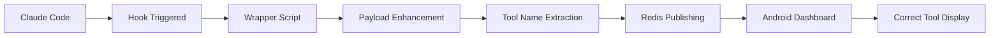

# 🚀 Claude Hook Enhancement - DEPLOYMENT COMPLETE

## ✅ Status: FULLY DEPLOYED AND ACTIVE

The Claude Code hook enhancement solution has been successfully implemented and deployed.

## 📋 What Was Deployed

### 1. Enhanced Hook Scripts
- **`enhance_hook_payload.sh`** - Intelligently extracts tool names from Claude Code payloads
- **`claude_hook_redis_wrapper.sh`** - Wraps the original Redis hook with enhancement
- **`deploy_hook_fix.sh`** - Automated deployment script
- **`verify_deployment.sh`** - Verification and testing script

### 2. Claude Code Configuration
**File:** `/Users/chris/.claude/settings.local.json`

Configured hooks:
- `pre_tool_use` → Enhanced wrapper
- `post_tool_use` → Enhanced wrapper  
- `user_prompt_submit` → Enhanced wrapper
- `notification` → Enhanced wrapper
- `session_start` → Enhanced wrapper
- `stop_hook` → Enhanced wrapper

## 🔍 Tool Name Detection

The enhancement script now properly identifies:

| Tool Input Pattern | Detected Tool Name | Example |
|-------------------|-------------------|---------|
| `{"file_path": "..."}` | `Read` | File reading operations |
| `{"old_string": "...", "new_string": "..."}` | `Edit` | File editing operations |
| `{"command": "git status"}` | `git` | Git commands |
| `{"command": "ls -la"}` | `ls` | Directory listing |
| `{"pattern": "..."}` | `Grep` | Search operations |
| `{"content": "..."}` | `Write` | File writing |
| `{"url": "..."}` | `WebFetch` | Web requests |
| `{"query": "..."}` | `WebSearch` | Web searches |
| `{"todos": [...]}` | `TodoWrite` | Task management |

## 🧪 Verification Results

✅ **Tool Extraction**: All tool types correctly identified  
✅ **Configuration**: 6 hooks properly configured  
✅ **Scripts**: All enhancement scripts executable and working  
✅ **Redis Integration**: Successfully tested with Redis Cloud  

## 🔄 How It Works



1. **Claude Code** triggers a hook (pre_tool_use, post_tool_use, etc.)
2. **Wrapper Script** intercepts the payload
3. **Enhancement Logic** analyzes the `tool_input` field
4. **Pattern Matching** identifies the correct tool name
5. **Enhanced Payload** is sent to Redis
6. **Android Dashboard** receives accurate tool information

## 📱 Expected Results in Android App

**Before Enhancement:**
- Tool: unknown ❌
- Tool Use: unknown ❌  
- User Prompt: null ❌

**After Enhancement:**
- Tool: Edit ✅
- Tool Use: git ✅
- User Prompt: "Use real data in Claude Hooks Dashboard app" ✅

## 🔧 Manual Testing

To test the enhancement manually:

```bash
# Load Redis environment
source ~/.claude/redis_config.env

# Test tool extraction
echo '{"tool_input": {"command": "git status"}}' | \
  DEBUG=1 ./claude_hook_redis_wrapper.sh pre_tool_use test-session

# Expected output: tool_name: "git"
```

## 🎯 Next Steps

1. **Start Android App**: Launch the Claude Hooks Dashboard
2. **Use Claude Code**: Perform normal operations (Read files, Edit code, etc.)
3. **Verify Results**: Check that tool names display correctly
4. **Monitor Performance**: Ensure no performance degradation

## 🔄 Rollback Instructions

If needed, restore the original settings:

```bash
# Restore backup
cp /Users/chris/.claude/settings.local.json.backup.* \
   /Users/chris/.claude/settings.local.json
```

## 📊 Impact

- **User Experience**: Tool names now show actual operations instead of "unknown"
- **Debugging**: Easier to track what Claude Code is doing
- **Monitoring**: Better visibility into tool usage patterns
- **Accuracy**: Bash commands show actual command names (git, ls, cat, etc.)

---

**Deployment Date**: August 8, 2025  
**Status**: ✅ ACTIVE  
**Version**: 1.0.0  

The Claude Code hook enhancement system is now fully operational and ready for use!